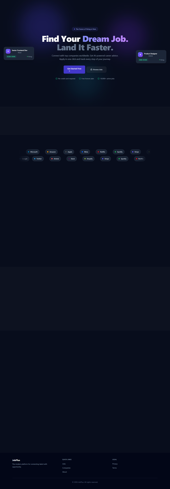
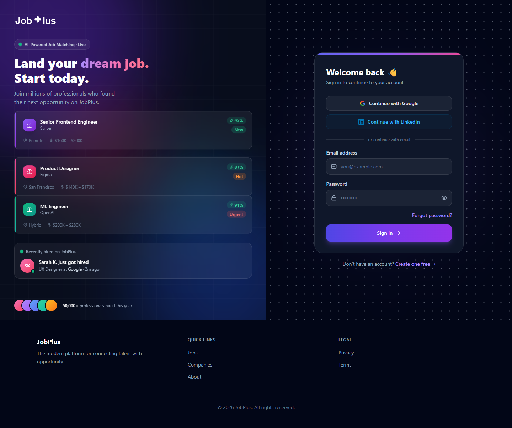
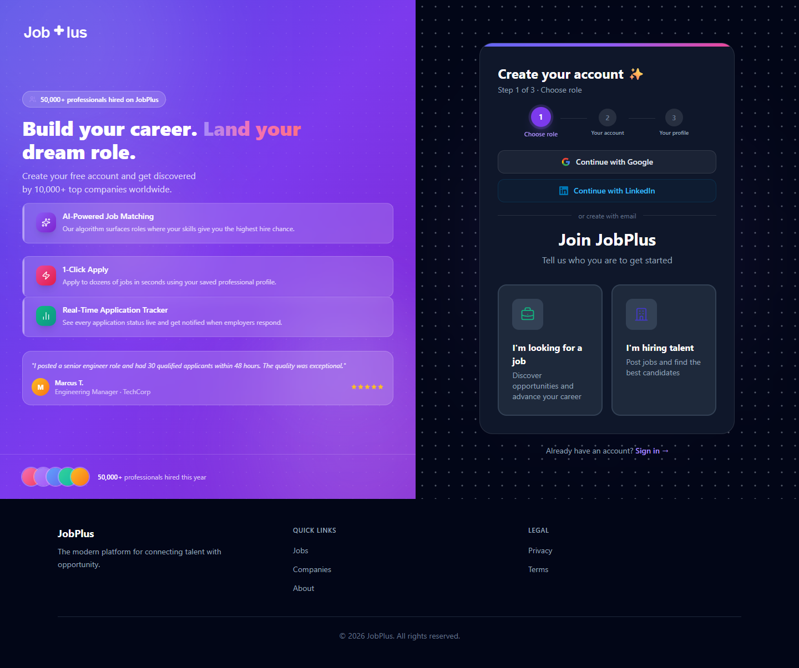

# JobPlus AI Recruitment Platform

JobPlus is a full-stack AI-assisted recruitment platform built for three core users: job seekers, employers, and administrators. It combines job discovery, profile management, social networking, employer hiring workflows, and admin moderation in one system.


## Overview

This project was designed as a modern recruitment platform with:

- role-based experiences for job seekers, employers, and admins
- AI-assisted career features such as interview coaching and matching support
- social networking features like posts, messaging, and connections
- employer workflows for company profiles, job posting, and applicant review
- admin dashboards for users, companies, jobs, posts, and audit logs

## Key Features

### Job Seeker

- account registration and authentication
- professional profile and settings management
- browse jobs and companies
- view job and company detail pages
- social feed, direct messages, and notifications
- AI interview coach and SmartMatch explanation page

### Employer

- employer registration flow
- employer dashboard
- company profile management
- create and manage job posts
- review applicants

### Admin

- admin dashboard
- user management
- company verification management
- job moderation
- post moderation
- audit log review

## Screenshots

### Landing Page



### Login Page



### Sign Up Page



## Tech Stack

| Layer | Technology |
|---|---|
| Backend | Java 17, Spring Boot, MyBatis |
| Frontend | React, TypeScript, Vite |
| Styling | Tailwind CSS, Framer Motion |
| Database | MySQL 8 |
| State / Data | Zustand, TanStack Query |
| Validation | React Hook Form, Zod |
| Charts | Recharts |

## Project Structure

```text
jobplus/
├── backup.sql
├── README.md
├── start-backend.bat
├── start-frontend.bat
├── docs/
│   └── screenshots/
├── jobplus-api/
└── jobplus-web/
```

### Main Paths

- Backend: `jobplus-api/`
- Frontend: `jobplus-web/`
- Screenshot assets for README: `docs/screenshots/`

## Architecture Summary

```text
React + Vite frontend
        │
        ▼
Spring Boot REST API
        │
        ▼
MyBatis + MySQL
```

## Setup Instructions

### Requirements

- Java 17+
- Maven 3.8+
- Node.js 18+
- npm 9+
- MySQL 8+

### 1. Database Setup

You can use either:

- `backup.sql`
- `jobplus-api/src/main/resources/db/schema.sql`
- `jobplus-api/src/main/resources/db/seed.sql`

Example:

```bash
mysql -u root -p -e "CREATE DATABASE jobplus;"
mysql -u root -p jobplus < jobplus-api/src/main/resources/db/schema.sql
mysql -u root -p jobplus < jobplus-api/src/main/resources/db/seed.sql
```

### 2. Backend Setup

Copy:

```bash
jobplus-api/.env.example -> jobplus-api/.env
```

Then update the environment values, especially:

- `DB_HOST`
- `DB_PORT`
- `DB_NAME`
- `DB_USERNAME`
- `DB_PASSWORD`
- `JWT_SECRET`
- `JWT_REFRESH_SECRET`

Run:

```bash
cd jobplus-api
mvn spring-boot:run
```

Or on Windows:

```bash
start-backend.bat
```

### 3. Frontend Setup

Copy:

```bash
jobplus-web/.env.example -> jobplus-web/.env
```

Run:

```bash
cd jobplus-web
npm install
npm run dev
```

Or on Windows:

```bash
start-frontend.bat
```

## Default Local URLs

- Frontend: `http://localhost:3000`
- Backend: `http://localhost:8080`

The frontend is configured to proxy `/api` requests to the backend running on port `8080`.

## Demo Accounts

| Role | Email | Password |
|---|---|---|
| Admin | `admin@jobplus.com` | `Admin@123!` |
| Employer | `recruiter@techcorp.com` | `Demo@123!` |
| Job Seeker | `alice@example.com` | `Demo@123!` |

## Submission Notes

This repository has been cleaned for submission and now focuses on source code, setup files, and essential project assets only.

Removed from the project folder:

- old reports
- PDFs and Word files
- logs
- screenshots not needed for GitHub
- generated build output
- `node_modules`
- `dist`
- `target`
- temporary local tooling files

## License

This project is released under the MIT License.
