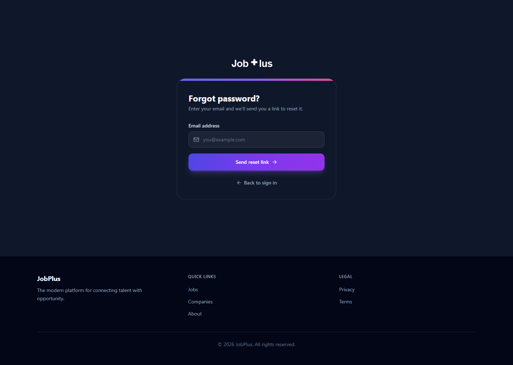
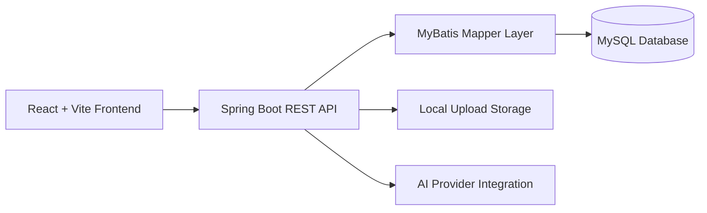
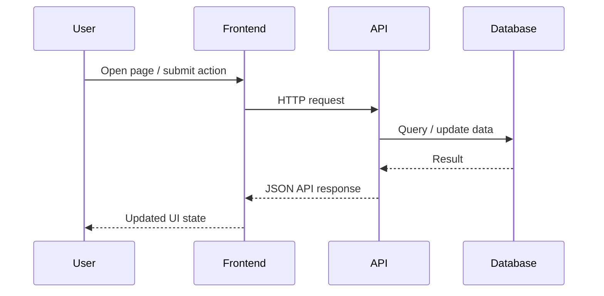

# JobPlus AI Recruitment Platform

JobPlus is a full-stack AI-assisted recruitment platform designed for job seekers, employers, and administrators. It combines hiring workflows, career tools, networking features, and platform moderation into one modern web application.

<p align="left">
  
  
  
  
  
  
</p>

<p align="center">
  
</p>

<p align="center">
  <strong>Recruitment platform.</strong>
  <strong>Career tools.</strong>
  <strong>Employer workflows.</strong>
  <strong>Admin control.</strong>
</p>

## Quick Navigation

| Section | Link |
|---|---|
| What Is JobPlus? | [Jump](#what-is-jobplus) |
| Feature Highlights | [Jump](#feature-highlights) |
| Screenshots | [Jump](#screenshots) |
| Tech Stack | [Jump](#tech-stack) |
| Getting Started | [Jump](#getting-started) |
| Demo Credentials | [Jump](#demo-credentials) |
| API Reference | [Jump](#api-reference) |
| Project Structure | [Jump](#project-structure) |
| Database | [Jump](#database) |
| localStorage Keys | [Jump](#localstorage-keys) |
| License | [Jump](#license) |

## What Is JobPlus?

JobPlus is an end-to-end recruitment product built to support the full hiring journey:

- Job seekers can build profiles, discover opportunities, connect with others, and use AI-assisted career tools.
- Employers can create company pages, publish jobs, and manage incoming applicants.
- Administrators can monitor users, companies, posts, jobs, and audit activity across the platform.

In short, JobPlus is not only a job board. It is a combined recruitment, networking, and hiring operations platform.

## Feature Highlights

| Area | Highlights |
|---|---|
| Job Seeker Experience | Sign up, build profile, browse jobs, save jobs, apply, receive notifications, message connections |
| Employer Experience | Create company profile, post jobs, manage listings, review applicants, maintain hiring flow |
| Admin Experience | Dashboard, user moderation, company verification, job moderation, post review, audit logs |
| AI Features | Interview coach, job-matching support, SmartMatch explanation page |
| Social Features | Feed posts, likes, comments, networking, direct messages |
| Platform Design | Role-based routing, animated UI, responsive layout, dark-mode support |

## Screenshots

### Landing & Authentication

<table>
  <tr>
    <td align="center" valign="top" width="50%">
      
      <br />
      <strong>Home - Welcome Screen</strong>
      <br />
      <sub>Hero introduction, featured sections, and onboarding entry points.</sub>
    </td>
    <td align="center" valign="top" width="50%">
      
      <br />
      <strong>Login</strong>
      <br />
      <sub>Authentication screen for returning users and role-based access.</sub>
    </td>
  </tr>
  <tr>
    <td align="center" valign="top" width="50%">
      
      <br />
      <strong>Register</strong>
      <br />
      <sub>Multi-step registration flow for both job seekers and employers.</sub>
    </td>
    <td align="center" valign="top" width="50%">
      
      <br />
      <strong>Password Recovery</strong>
      <br />
      <sub>Account recovery flow for returning users who need credential reset.</sub>
    </td>
  </tr>
</table>

## Tech Stack

### Frontend

| Category | Technology |
|---|---|
| Framework | React 18 |
| Language | TypeScript |
| Build Tool | Vite |
| Styling | Tailwind CSS |
| Motion | Framer Motion |
| Routing | React Router DOM |
| Forms | React Hook Form + Zod |
| Charts | Recharts |
| Icons | Lucide React |
| Testing | Vitest + Testing Library |

### Backend

| Category | Technology |
|---|---|
| Runtime | Java 17 |
| Framework | Spring Boot 3.3.5 |
| Data Access | MyBatis |
| Database | MySQL 8 |
| Security | Spring Security + JWT |
| Validation | Jakarta Bean Validation |
| Mail | Spring Mail |
| Build Tool | Maven |
| Testing | JUnit 5 + Mockito + MockMvc |

### Storage & State

| Concern | Solution |
|---|---|
| Server State | TanStack Query |
| Global Client State | Zustand |
| Authentication Persistence | Zustand Persist + `localStorage` |
| HTTP Token Handling | Axios interceptors |
| File Storage | Local uploads folder on backend |
| Primary Database | MySQL |

## Architecture



## Request Flow



## Getting Started

### Requirements

| Tool | Version |
|---|---|
| Java | 17+ |
| Maven | 3.8+ |
| Node.js | 18+ |
| npm | 9+ |
| MySQL | 8+ |

### 1. Clone the Repository

```bash
git clone https://github.com/thedramer20/jobsplus-ai-recruitment-platform.git
cd jobsplus-ai-recruitment-platform
```

### 2. Database Setup

You can use either:

- `backup.sql`
- `jobplus-api/src/main/resources/db/schema.sql`
- `jobplus-api/src/main/resources/db/seed.sql`

Example:

```bash
mysql -u root -p -e "CREATE DATABASE jobplus;"
mysql -u root -p jobplus < jobplus-api/src/main/resources/db/schema.sql
mysql -u root -p jobplus < jobplus-api/src/main/resources/db/seed.sql
```

### 3. Backend Setup

Copy the backend environment template:

```bash
jobplus-api/.env.example -> jobplus-api/.env
```

Then update values such as:

- `DB_HOST`
- `DB_PORT`
- `DB_NAME`
- `DB_USERNAME`
- `DB_PASSWORD`
- `JWT_SECRET`
- `JWT_REFRESH_SECRET`

Run the backend:

```bash
cd jobplus-api
mvn spring-boot:run
```

Or on Windows:

```bash
start-backend.bat
```

### 4. Frontend Setup

Copy the frontend environment template:

```bash
jobplus-web/.env.example -> jobplus-web/.env
```

Install dependencies and run:

```bash
cd jobplus-web
npm install
npm run dev
```

Or on Windows:

```bash
start-frontend.bat
```

### 5. Default Local URLs

| Service | URL |
|---|---|
| Frontend | `http://localhost:3000` |
| Backend | `http://localhost:8080` |

The frontend is configured to proxy `/api` requests to the backend.

## Demo Credentials

| Role | Email | Password | Usage |
|---|---|---|---|
| Admin | `admin@jobplus.com` | `Admin@123!` | Admin dashboard and moderation |
| Employer | `recruiter@techcorp.com` | `Demo@123!` | Company profile, jobs, applicants |
| Job Seeker | `alice@example.com` | `Demo@123!` | Feed, jobs, profile, AI tools |

## API Reference

<details>
<summary><strong>Open API route summary</strong></summary>

<br />

### Main Route Groups

| Route Group | Purpose | Access |
|---|---|---|
| `POST /api/auth/register` | Register account | Public |
| `POST /api/auth/login` | Login and receive tokens | Public |
| `POST /api/auth/refresh` | Refresh access token | Authenticated |
| `GET /api/jobs` | Browse jobs | Mixed |
| `GET /api/jobs/{id}` | Job detail | Mixed |
| `POST /api/applications` | Apply to a job | Authenticated |
| `GET /api/companies` | Browse companies | Mixed |
| `GET /api/posts` | Social feed | Authenticated |
| `GET /api/messages` | Messaging | Authenticated |
| `GET /api/notifications` | Notifications | Authenticated |
| `POST /api/chatbot/message` | AI chat support | Authenticated |
| `GET /api/admin/**` | Admin operations | Admin only |

### Response Shape

```json
{
  "success": true,
  "data": {},
  "message": "Operation completed",
  "timestamp": "2026-06-18T12:00:00Z"
}
```

</details>

## Project Structure

```text
jobplus/
|-- backup.sql
|-- LICENSE
|-- README.md
|-- start-backend.bat
|-- start-frontend.bat
|-- docs/
|   `-- screenshots/
|-- jobplus-api/
|   |-- src/main/java/com/jobplus/
|   |-- src/main/resources/
|   |-- src/test/
|   `-- pom.xml
`-- jobplus-web/
    |-- src/
    |-- package.json
    `-- vite.config.ts
```

### Backend Package Overview

| Package | Responsibility |
|---|---|
| `config` | CORS, mail, MVC configuration |
| `controller` | REST endpoints |
| `service` | Business logic interfaces |
| `service/impl` | Business logic implementations |
| `mapper` | MyBatis interfaces |
| `model` | Core domain models |
| `dto` | Request and response DTOs |
| `security` | JWT and security configuration |
| `exception` | Error handling |

## Database

<details>
<summary><strong>Open database overview</strong></summary>

<br />

### Main Domain Areas

| Domain | Tables |
|---|---|
| Accounts & Profiles | `user`, `user_settings`, `password_reset_token`, `seeker_profile`, `experience`, `education`, `skill`, `user_skill` |
| Companies & Jobs | `company`, `company_member`, `job`, `job_skill`, `application`, `saved_job` |
| Social Layer | `post`, `post_like`, `post_comment`, `connection`, `conversation`, `conversation_participant`, `message` |
| Notifications & Admin | `notification`, `audit_log` |

### Database Notes

- MySQL 8 is the primary database.
- The schema is defined in `jobplus-api/src/main/resources/db/schema.sql`.
- Seed data is provided in `seed.sql`.
- A full backup is included as `backup.sql`.

</details>

## localStorage Keys

<details>
<summary><strong>Open frontend persistence keys</strong></summary>

<br />

| Key | Purpose |
|---|---|
| `jobplus-auth` | Persisted Zustand auth store |
| `jobplus_token` | Access token used by the API client |
| `jobplus_refresh_token` | Refresh token for session renewal |
| `jobplus_theme` | Saved theme preference |

</details>

## Submission Notes

This repository was cleaned for submission and now focuses on source code, essential setup files, and a lightweight GitHub presentation layer.

Removed from the original working folder:

- reports
- PDFs and Word files
- logs
- old screenshots
- generated build output
- `node_modules`
- `dist`
- `target`
- temporary local tooling files

## License

This project is licensed under the MIT License. See the [LICENSE](LICENSE) file for details.
